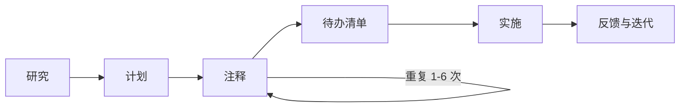
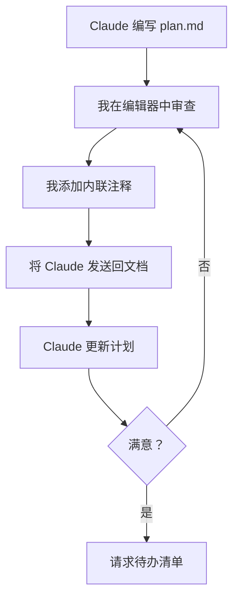
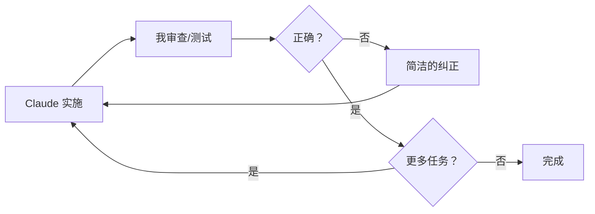
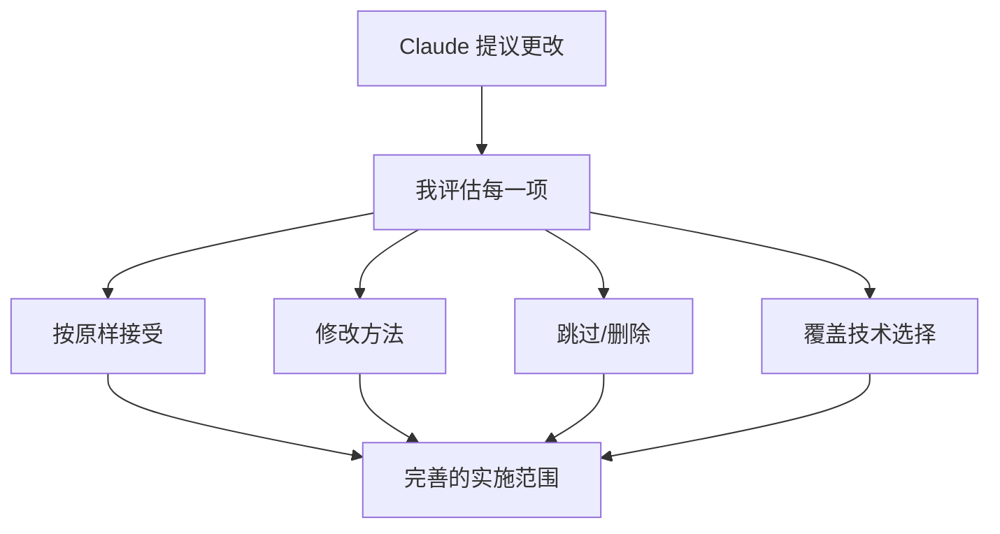

我将 Claude Code 作为主要开发工具已经大约 9 个月了，而我形成的工作流程与大多数人对 AI 编程工具的使用方式有着根本性的不同。大多数开发者输入提示词，有时使用计划模式，修复错误，然后重复。更极端的在线用户则在拼凑 ralph loops、MCP、gas towns（还记得那些吗？）等等。这两种情况的结果都是一团糟，对于任何非平凡的任务都会完全崩溃。

我要描述的工作流程有一个核心原则：**在审查并批准书面计划之前，永远不要让 Claude 编写代码**。这种将规划和执行分离是我所做的最重要的事情。它避免了浪费精力，让我保持对架构决策的控制，并且相比直接跳到编码，能够以最少的 token 使用量产生显著更好的结果。

## 第一阶段：研究

每个有意义的任务都以深度阅读指令开始。我要求 Claude 在做其他任何事情之前先彻底理解代码库的相关部分。而且我总是要求将发现写入到一个持久的 markdown 文件中，而不仅仅是在聊天中口头总结。

> 深入阅读这个文件夹，深刻理解它是如何工作的、它做什么以及所有细节。完成后，将你的学习和发现写一份详细的报告到 research.md

> 非常详细地研究通知系统，理解其中的错综复杂，并写一份详细的 research.md 文档，包含关于通知如何工作的所有知识

> 仔细检查任务调度流程，深入理解它并寻找潜在的 bug。系统中肯定有 bug，因为它有时会运行应该被取消的任务。继续研究流程，直到找到所有 bug，在找到所有 bug 之前不要停止。完成后，将你的发现写一份详细的报告到 research.md

注意这些措辞：**"深入"**、**"非常详细"**、**"错综复杂"**、**"检查所有内容"**。这不是废话。没有这些词，Claude 会略读。它会阅读一个文件，在签名级别查看函数的作用，然后继续。你需要发出信号，表明表面级别的阅读是不可接受的。

书面成果（`research.md`）至关重要。这并不是要让 Claude 做作业。这是我的审查表面。我可以阅读它，验证 Claude 确实理解了系统，并在进行任何规划之前纠正误解。如果研究是错误的，计划就是错误的，实施也将是错误的。垃圾进，垃圾出。

这是 AI 辅助编码中最昂贵的失败模式，不是错误的语法或糟糕的逻辑。而是那些在孤立中工作但破坏周围系统的实施。一个忽略现有缓存层的函数。一个不考虑 ORM 约定的迁移。一个重复其他地方已存在逻辑的 API 端点。研究阶段可以防止所有这些。

## 第二阶段：规划

一旦我审查了研究，我会要求在一个单独的 markdown 文件中提供详细的实施计划。

> 我想构建一个新功能 <名称和描述>，扩展系统以执行 <业务结果>。写一份详细的 plan.md 文档，概述如何实现这一点。包括代码片段

> 列表端点应该支持基于游标的分页而不是偏移量。写一份详细的 plan.md 来说明如何实现这一点。在建议更改之前阅读源文件，基于实际代码库制定计划

生成的计划总是包括方法的详细解释、显示实际更改的代码片段、将被修改的文件路径，以及考虑因素和权衡。

我使用自己的 `.md` 计划文件，而不是 Claude Code 内置的计划模式。内置的计划模式很糟糕。我的 markdown 文件给了我完全的控制权。我可以在编辑器中编辑它，添加内联注释，并且它作为项目中的真实成果持久存在。

**我经常使用的一个技巧：** 对于那些我在开源仓库中见过良好实现的、封装良好的功能，我会将该代码作为参考与计划请求一起分享。如果我想添加可排序的 ID，我会从一个做得好的项目中粘贴 ID 生成代码，并说"这就是他们实现可排序 ID 的方式，写一份 plan.md 解释我们如何采用类似的方法。"当 Claude 有一个具体的参考实现可供借鉴，而不是从头开始设计时，它的效果会显著更好。

但计划文档本身并不是有趣的部分。有趣的部分是接下来发生的事情。

## 注释循环

这是我工作流程中最独特的部分，也是我增加最多价值的部分。

在 Claude 编写计划后，我在编辑器中打开它，并**直接在文档中添加内联注释**。这些注释纠正假设、拒绝方法、添加约束或提供 Claude 没有的领域知识。

注释的长度差异很大。有时注释只有两个字：在 Claude 标记为可选的参数旁边写着"不可选"。有时则是一段解释业务约束或粘贴代码片段以显示我期望的数据形状。

我会添加的一些真实注释示例：

- _"使用 drizzle:generate 进行迁移，而不是原始 SQL"_ — Claude 没有的领域知识
- _"不 — 这应该是 PATCH，而不是 PUT"_ — 纠正错误的假设
- _"完全删除这一部分，我们这里不需要缓存"_ — 拒绝提议的方法
- _"队列消费者已经处理重试，所以这个重试逻辑是多余的。删除它，让它失败"_ — 解释为什么某些东西应该改变
- _"这是错误的，可见性字段应该在列表本身上，而不是在单个项目上。当列表是公开的时，所有项目都是公开的。相应地重新构建模式部分"_ — 重定向计划的整个部分

然后我将 Claude 发送回文档：

> 我在文档中添加了一些注释，处理所有注释并相应地更新文档。暂时不要实施

**这个循环重复 1 到 6 次。** 明确的**"暂时不要实施"**保护措施是必不可少的。没有它，一旦 Claude 认为计划足够好，就会跳到编码。在我说是之前，它还不够好。

### 为什么这如此有效

markdown 文件充当我和 Claude 之间的**共享可变状态**。我可以按照自己的节奏思考，准确地注释错误的地方，并在不失去上下文的情况下重新参与。我并不是试图在聊天消息中解释所有内容。我指向文档中确切的错误位置，并在那里写下我的纠正。

这与试图通过聊天消息引导实施有着根本的不同。计划是一个结构化的、完整的规范，我可以全面审查。聊天对话是我必须滚动浏览才能重构决策的东西。计划每次都获胜。

三轮"我添加了注释，更新计划"可以将通用的实施计划转变为完美适合现有系统的计划。Claude 擅长理解代码、提出解决方案和编写实施。但它不知道我的产品优先级、我用户的痛点，或者我愿意做出的工程权衡。注释循环就是我注入这些判断的方式。

### 待办清单

在实施开始之前，我总是请求一个详细的任务分解：

> 在计划中添加一个详细的待办清单，包含完成计划所需的所有阶段和单个任务 - 暂时不要实施

这创建了一个检查清单，作为实施期间的进度跟踪器。Claude 在进行过程中将项目标记为已完成，所以我可以随时查看计划，确切地看到事情所处的状态。在运行数小时的会话中特别有价值。

## 第三阶段：实施

当计划准备好后，我发出实施命令。我将其提炼为我在会话中重复使用的标准提示：

> 实施所有内容。完成任务或阶段后，在计划文档中将其标记为已完成。在所有任务和阶段完成之前不要停止。不要添加不必要的注释或 jsdocs，不要使用 any 或 unknown 类型。持续运行类型检查以确保你没有引入新问题。

这个单一提示编码了所有重要的事情：

- _"实施所有内容"_：执行计划中的所有内容，不要挑选
- _"在计划文档中将其标记为已完成"_：计划是进度的真实来源
- _"在所有任务和阶段完成之前不要停止"_：不要在流程中途暂停确认
- _"不要添加不必要的注释或 jsdocs"_：保持代码整洁
- _"不要使用 any 或 unknown 类型"_：保持严格类型
- _"持续运行类型检查"_：及早发现问题，而不是在最后

我几乎在每个实施会话中都使用这个确切的措辞（稍作变化）。当我说"实施所有内容"时，每个决定都已经做出并经过验证。实施变得机械化，而不是创造性。这是故意的。**我希望实施是无聊的**。创造性工作发生在注释循环中。一旦计划正确，执行应该是直截了当的。

没有规划阶段，典型的情况是 Claude 早期做出了一个合理但错误的假设，在此基础上构建了 15 分钟，然后我必须撤销一系列更改。"暂时不要实施"保护措施完全消除了这个问题。

## 实施期间的反馈

一旦 Claude 开始执行计划，我的角色从架构师转变为监督者。我的提示变得明显更短。

如果规划注释可能是一段话，那么实施纠正通常只有一句话：

- _"你没有实现 `deduplicateByTitle` 函数。"_
- _"你在主应用程序中构建了设置页面，而它应该在管理应用程序中，移动它。"_

Claude 拥有计划和正在进行会话的完整上下文，所以简洁的纠正就足够了。

前端工作是最具迭代性的部分。我在浏览器中测试并快速发出纠正：

- _"更宽"_
- _"仍然被裁剪"_
- _"有 2px 的间隙"_

对于视觉问题，我有时会附加截图。错位表格的截图比描述它更快地传达问题。

我还不断引用现有代码：

- _"这个表格应该看起来完全像用户表格，相同的标题、相同的分页、相同的行密度。"_

这比从头开始描述设计更精确。成熟代码库中的大多数功能都是现有模式的变体。新的设置页面应该看起来像现有的设置页面。指向参考传达了所有隐含要求，而不需要逐一说明。Claude 通常在进行纠正之前阅读参考文件。

当事情朝错误的方向发展时，我不试图修补它。我会恢复并通过丢弃 git 更改来重新确定范围：

- _"我恢复了所有内容。现在我想做的就是让列表视图更简约 — 仅此而已。"_

恢复后缩小范围几乎总是比尝试增量修复糟糕的方法产生更好的结果。

## 保持主导地位

即使我将实施委托给 Claude，**我从不给它对构建内容的完全自主权**。我在 `plan.md` 文档中进行绝大多数的主动引导。

这很重要，因为 Claude 有时会提出技术上正确但对项目来说是错误的解决方案。也许方法过度设计，或者它改变了系统其他部分依赖的公共 API 签名，或者当简单的选项可以做到时，它选择了更复杂的选项。我有关于更广泛的系统、产品方向和 Claude 所没有的工程文化的上下文。

**从提议中挑选：** 当 Claude 识别多个问题时，我会逐个检查：_"对于第一个，只使用 Promise.all，不要让它过于复杂；对于第三个，将其提取为单独的函数以提高可读性；忽略第四个和第五个，它们不值得复杂化。"_ 我根据我对当前重要事情的知识做出项目级别的决策。

**修剪范围：** 当计划包括有好的功能时，我会主动删除它们。_"从计划中删除下载功能，我现在不想实现这个。"_ 这防止范围蔓延。

**保护现有接口：** 当我知道某些东西不应该改变时，我会设置硬约束：_"这三个函数的签名不应该改变，调用者应该适应，而不是库。"_

**覆盖技术选择：** 有时我有 Claude 不知道的特定偏好：_"使用这个模型而不是那个"_ 或 _"使用这个库的内置方法，而不是编写自定义方法。"_ 快速、直接的覆盖。

Claude 处理机械执行，而我做出判断调用。计划预先捕获了重大决策，选择性指导处理实施期间出现的较小决策。

## 单个长会话

我在**单个长会话**中运行研究、规划和实施，而不是将它们分散到单独的会话中。单个会话可能从深度阅读文件夹开始，经过三轮计划注释，然后运行完整的实施，所有这些都在一个连续的对话中。

在 50% 上下文窗口之后，我并没有看到大家谈论的性能下降。实际上，当我说"实施所有内容"时，Claude 已经在整个会话中建立理解：在研究期间阅读文件，在注释循环中完善其心理模型，吸收我的领域知识纠正。

当上下文窗口填满时，Claude 的自动压缩保持了足够的上下文以继续。而且计划文档，即持久的成果，以完全的保真度幸免于压缩。我可以在任何时间点将 Claude 指向它。

## 一句话总结工作流程

深入阅读，编写计划，注释计划直到正确，然后让 Claude 执行所有内容而不停止，同时检查类型。

就是这样。没有魔法提示，没有复杂的系统指令，没有聪明的技巧。只是一个将思考与打字分开的有纪律的管道。研究防止 Claude 做出无知的更改。计划防止它做出错误的更改。注释循环注入我的判断。实施命令让它在做出每个决定后不间断地运行。

试试我的工作流程，你会想知道在没有注释计划文档作为你与代码之间的桥梁的情况下，你是如何用编码代理交付任何东西的。

---

> **文章来源：** [How I Use Claude Code](https://boristane.com/blog/how-i-use-claude-code/) by Boris Tane
>
> **翻译日期：** 2026年2月24日
